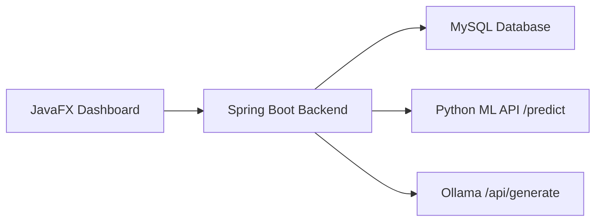

# Symptosis AI - Intelligent Symptom Progression Analytics System

Symptosis AI is a BTech AIML-level academic project that tracks symptom progression over time and predicts escalation risk without performing disease diagnosis. The system combines advanced Java, Spring Boot APIs, a Python scikit-learn model, a local Ollama LLM, and a JavaFX desktop dashboard.

## Problem Definition

Healthcare systems often record isolated patient visits but do not continuously analyze symptom progression. Symptosis AI addresses this gap by tracking severity, frequency, and duration patterns to estimate escalation risk.

- Problem: Lack of continuous symptom progression tracking and early risk prediction.
- Objective: Analyze symptom severity, frequency, and duration to predict escalation risk.
- Scope: Symptom analytics only. No disease diagnosis is performed.
- Outputs: `LOW`, `MEDIUM`, or `HIGH` risk, plus rule-based and AI-generated explanation.

## 4-Layer Architecture

1. Backend layer: Java Spring Boot REST API
2. ML layer: Python Flask API using scikit-learn Logistic Regression
3. LLM layer: Ollama local model through `/api/generate`
4. Frontend layer: JavaFX dashboard for entry, charts, risk, and explanations



## Project Structure

- `backend/` Spring Boot backend
- `frontend/` JavaFX desktop client
- `ml-model/` dataset generator, dataset, model training, and Flask prediction API
- `.env.example` environment template
- `sample-outputs/` demo responses
- `viva-support.md` viva answers

## Core Java Classes

- `Patient`: patient master record
- `Symptom`: symptom catalog item
- `SymptomRecord`: time-stamped symptom progression record
- `SymptomAnalyzer`: trend analytics logic
- `RiskEvaluator`: configuration-driven scoring and classification
- `DataManager`: Singleton cache plus file audit logging
- DTO classes: clean REST payload separation

## OOP Concepts Used

- Encapsulation: private fields with getters and setters
- Abstraction: services separate controllers from analytics logic
- Modularity: layered packages for controller, service, model, repository, dto, config
- Singleton pattern: `DataManager`
- DTO pattern: request/response classes for API boundaries
- Collections and Streams: history processing and averaging
- Exception handling: global REST validation and not-found handling
- File handling: audit log written to `logs/risk-audit.log`

## Environment Configuration

Create a root `.env` file by copying `.env.example`:

```powershell
Copy-Item .env.example .env
```

Then update the values for your local machine:

```env
SERVER_PORT=8080
DB_URL=jdbc:mysql://localhost:3306/symptosis
DB_USER=root
DB_PASSWORD=your_password_here

ML_API_URL=http://localhost:5000/predict
ML_TIMEOUT=3000

OLLAMA_BASE_URL=http://localhost:11434
OLLAMA_MODEL=llama3
OLLAMA_TIMEOUT=5000

WEIGHT_SEVERITY=0.5
WEIGHT_FREQUENCY=0.3
WEIGHT_DURATION=0.2

ENABLE_ML=true
ENABLE_LLM=true
ENABLE_LOGGING=true
```

- Spring Boot loads `.env` through `AppConfig` using `dotenv-java`.
- Python loads `.env` through `python-dotenv`.
- `.env.example` is safe to commit; your real `.env` should stay local only.

## Risk Engine

Score formula:

```text
score =
 (severityTrend * WEIGHT_SEVERITY) +
 (frequency * WEIGHT_FREQUENCY) +
 (duration * WEIGHT_DURATION / 10)
```

Classification used in backend:

- `LOW` when score < 4.0
- `MEDIUM` when score >= 4.0 and < 7.5
- `HIGH` when score >= 7.5

Weights are configurable through `.env`, so demo changes are immediate after restart.

## REST API Endpoints

### `POST /patients`
Create patient.

Sample request:

```json
{
  "fullName": "Aarav Shah",
  "patientCode": "PT-1001",
  "age": 24,
  "gender": "Male"
}
```

### `POST /symptoms`
Add symptom progression record.

```json
{
  "patientId": 1,
  "symptomName": "Fever",
  "symptomCategory": "General",
  "severity": 8,
  "frequency": 7,
  "durationMinutes": 45,
  "timestamp": "2026-03-31T10:30:00",
  "note": "Increasing discomfort over 2 days"
}
```

### `GET /patients/{id}`
Return patient profile and symptom history.

### `GET /risk/{patientId}`
Return risk level, rule score, analytics snapshot, and ML contribution.

### `GET /explanation/{patientId}`
Return explanation generated by Ollama or fallback text.

## ML Layer Explanation

The Python ML module contains:

- `generate_dataset.py`: creates 1200 realistic synthetic rows for the last 30 days
- `dataset.csv`: generated dataset with no missing values
- `train.py`: preprocessing, training, evaluation, and `model.pkl` creation
- `api.py`: Flask inference endpoint `/predict`
- `model.py`: model loading and prediction helper

### Dataset Columns

- `event_id`
- `timestamp`
- `incident_severity`
- `frequency_rate`
- `avg_duration_minutes`
- `system_tier`
- `resource_type`
- `is_peak_hours`
- `source_sensor_id`
- `ingestion_latency_ms`
- `risk_category`

### Dataset Rules

- `HIGH`: severity >= 7, frequency >= 6, duration >= 30, system tier 3, peak hours 1
- `LOW`: severity <= 4, low frequency, short duration, system tier 1
- Else: `MEDIUM`

### ML Pipeline

- Categorical encoding with `OneHotEncoder`
- Numeric passthrough with `ColumnTransformer`
- Logistic Regression classifier
- Accuracy displayed after training
- Model stored in `ml-model/model.pkl`

## Ollama LLM Explanation Layer

Backend prompt template:

```text
Patient data:
Severity trend: {value}
Frequency: {value}
Duration: {value}
Risk: {risk}

Explain clearly why this risk level is assigned.
```

- Endpoint used: `POST /api/generate`
- Base URL and model are config-driven from `.env`
- If LLM is disabled or unavailable, backend returns a static explanation

## JavaFX Dashboard Features

- Add patient
- Add symptom progression records
- View history
- Show risk level with color indicator
- Show explanation area
- Line chart for severity trend over time

## Setup Steps

### 1. MySQL database

Create a database named `symptosis`:

```sql
CREATE DATABASE symptosis;
```

### 2. Run backend

```bash
cd backend
mvn spring-boot:run
```

### 3. Run ML API

```bash
cd ml-model
pip install -r requirements.txt
python generate_dataset.py
python train.py
python api.py
```

### 4. Run Ollama

Install Ollama and pull the model:

```bash
ollama pull llama3
ollama serve
```

### 5. Run JavaFX dashboard

```bash
cd frontend
mvn javafx:run
```

## Demo Cases

### HIGH risk case

Use records such as:

- severity: 8 to 10
- frequency: 7 to 9
- duration: 40 to 60 minutes

Expected result: `HIGH`

### LOW risk case

Use records such as:

- severity: 2 to 3
- frequency: 1 to 2
- duration: 5 to 15 minutes

Expected result: `LOW`

### Faculty demo toggles

- Set `ENABLE_ML=false` to show pure rule-based risk
- Set `ENABLE_LLM=false` to show static explanation fallback
- Change `WEIGHT_*` values in `.env` and restart backend to observe output changes

## Sample Outputs

See these files:

- [high-risk-response.json](./sample-outputs/high-risk-response.json)
- [low-risk-response.json](./sample-outputs/low-risk-response.json)
- [demo-notes.txt](./sample-outputs/demo-notes.txt)

## Why No Diagnosis?

The system is intentionally limited to symptom analytics for academic safety, ethical clarity, and scope control. It predicts escalation risk, not diseases or treatment.

## Future Scope

- Personalized symptom baselines
- Time-series models such as LSTM or XGBoost comparison
- Doctor/nurse alert workflows
- Cloud deployment and role-based authentication
- Wearable device ingestion and real-time streaming analytics
